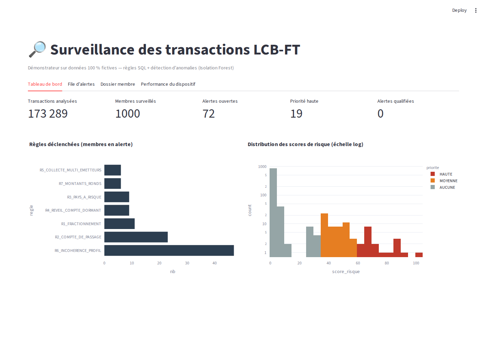
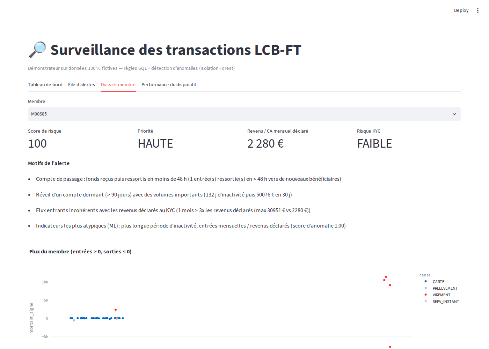

# Surveillance des transactions LCB-FT — règles SQL + détection d'anomalies

Démonstrateur d'un dispositif de **monitoring des transactions** pour un établissement de paiement :
il combine des **scénarios métier écrits en SQL** et une **détection d'anomalies non supervisée**
(Isolation Forest). Il produit une **file d'alertes priorisée et explicable**, et l'analyste
**qualifie** chaque alerte (décision horodatée et justifiée, pour garder une trace d'audit).

> ⚠️ Toutes les données sont **fictives** et générées par le script `src/generate_data.py`.
> Les seuils et la liste de pays sont des exemples pédagogiques, pas des références réglementaires.



## Pourquoi ce projet

En LCB-FT, les règles seules ne voient que les scénarios prévus, et le ML seul n'est pas explicable
(un analyste doit pouvoir justifier une décision devant le régulateur). Ce projet montre une
approche **hybride** :

| Brique | Rôle | Techno |
|---|---|---|
| Règles (R1 à R7) | Traduire les typologies connues en scénarios contrôlables | SQL (SQLite, fonctions de fenêtrage, `LAG`, `RANGE`, `NOT EXISTS`) |
| Détection d'anomalies | Repérer les comportements atypiques non prévus par les règles | Python, scikit-learn (Isolation Forest) |
| Score de risque 0-100 | Prioriser la file d'alertes | Règles pondérées + ML plafonné à 30 points + majoration si risque KYC élevé |
| Interface analyste | Tableau de bord, dossier membre, qualification tracée | Streamlit, Plotly |

## Les scénarios de détection

| Code | Typologie | Logique |
|---|---|---|
| R1 | Fractionnement | ≥ 3 virements entrants entre 85 % et 100 % du seuil de vigilance sur 7 jours glissants |
| R2 | Compte de passage | Entrée ≥ 5 000 € ressortie à ≥ 80 % en moins de 48 h vers des bénéficiaires nouveaux |
| R3 | Pays à risque | Flux avec un pays d'une liste paramétrable (à aligner sur les listes GAFI / UE en vigueur) |
| R4 | Réveil de compte dormant | > 90 jours d'inactivité puis > 10 000 € de flux en 30 jours |
| R5 | Collecte multi-émetteurs | ≥ 15 émetteurs distincts sur 30 jours glissants (particuliers) |
| R6 | Incohérence avec le profil KYC | Entrées mensuelles > 3 fois les revenus déclarés (poids renforcé si répété) |
| R7 | Montants ronds | ≥ 5 opérations ≥ 2 000 € en multiples de 1 000 € |

Chaque alerte affiche **des motifs lisibles** (règles déclenchées et détail chiffré) ainsi que
**les indicateurs les plus atypiques** selon le modèle.



## Résultats (jeu de 1 000 membres, 173 000 transactions, 60 cas suspects injectés)

Comme les données sont fictives, on sait quels membres ont un comportement suspect : on peut donc
**mesurer** le dispositif.

| Indicateur | Valeur |
|---|---|
| Alertes générées | 72 (7 % des membres) |
| Précision (part des alertes justifiées) | 78 % |
| Rappel (part des cas suspects détectés) | 93 % |
| Temps d'exécution | ~3 s |

Toutes les typologies sont détectées à 100 %, sauf **deux cas intéressants** :

- **Collecte sur un compte professionnel** (75 %) : R5 exclut volontairement les professionnels, pour qui
  recevoir beaucoup de paiements est normal. Le cas n'est rattrapé que si le ML le juge atypique. Piste :
  un seuil propre à chaque secteur d'activité (code NAF) du professionnel.
- **Montants ronds** (75 %) : c'est un signal faible, donc il pèse peu à lui seul. C'est un choix assumé pour
  limiter les faux positifs.

Les faux positifs restants sont **réalistes** : un héritage ou une vente immobilière (entrée
exceptionnelle), ou un professionnel qui paie de nouveaux fournisseurs. Ce sont justement les cas où
l'analyste demande des justificatifs.

> Ces chiffres sont obtenus sur des données synthétiques, donc plus « propres » que la réalité.
> En production, le taux de faux positifs d'un dispositif de surveillance est bien plus élevé, et l'enjeu
> principal est le calibrage des seuils.

## Lancer le projet

```bash
python -m venv .venv && source .venv/bin/activate
pip install -r requirements.txt

python src/generate_data.py          # génère data/membres.csv et data/transactions.csv
python src/run_pipeline.py           # règles + ML + score -> output/alertes.csv, affiche précision / rappel
streamlit run app.py                 # interface analyste sur http://localhost:8501
pytest -q                            # tests
```

## Structure

```
├── app.py                  # interface analyste (Streamlit)
├── src/
│   ├── config.py           # seuils, pays à risque, poids des règles (appétence au risque)
│   ├── generate_data.py    # jeu de données fictif + injection des typologies
│   ├── rules.sql           # les 7 scénarios en SQL
│   ├── rules.py            # exécution des règles sur SQLite
│   ├── ml.py               # indicateurs comportementaux + Isolation Forest
│   ├── scoring.py          # score de risque, priorité, motifs
│   ├── evaluate.py         # précision / rappel par typologie
│   └── run_pipeline.py     # pipeline de bout en bout
├── tests/
└── docs/                   # captures d'écran
```

## Limites et pistes d'amélioration

- Filtrage des listes de sanctions et de gel des avoirs (DG Trésor, UE, ONU) par correspondance
  approximative des noms.
- Seuils propres à chaque segment (particulier, professionnel par secteur, nouvel entrant) et à chaque
  niveau de risque KYC.
- Exploitation du retour des analystes (décisions de qualification) pour recalibrer les poids des règles.
- Analyse de réseau (graphe des contreparties) pour détecter les réseaux de mules.
- Traitement en temps réel (flux) plutôt que par lot.

## Contexte

Projet personnel réalisé par **Stéphane Hounkpatin** (Ingénieur Cybersécurité & GRC, MSc Risk Management,
Contrôle & Compliance – INSEEC). Il sert à explorer l'apport de la data à la conformité LCB-FT.
